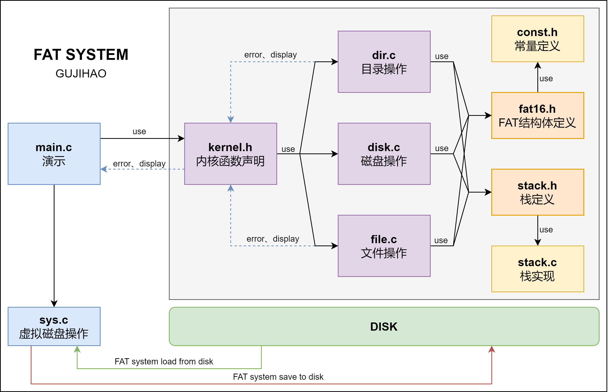

# FAT

操作系统课程设计：建立基于磁盘存储设备的 FAT 文件系统

FAT系统的搭建细节可以参考实验报告

题目： 磁盘文件系统：建立基于磁盘存储设备的 FAT 文件系统。（1-2 人，难度：4）

- 首先分配一定容量的磁盘存储空间，作为文件存储空间；
- 建立相应的文件系统，使用 FAT 文件系统；
- 解决文件的重名、共享和安全控制；
- 支持文件的“按名存取”；
- 为该文件系统设计相应的数据结构来管理目录、磁盘空闲空间、已分配空间等。
- 提供文件的创建、删除、移位、改名等功能。
- 提供良好的界面，可以显示磁盘文件系统的状态和空间的使用情况；
- 提供虚拟磁盘转储功能，可将信息存入磁盘，还可从磁盘读入内存；

**结构**：


code文件夹内有三个项目，fat16 lib uselib

- fat16 源代码，可以直接运行
- lib 生成动态和静态链接库的项目
- uselib 使用动态链接库运行的项目

建议使用CLion并用cmake编译

**用法**：
``` bash
Useage:[order] -[option]
    ls      --list-files                list files and directory on current directory
    format  --format                    format this file system
    cd      --change-directory         change current directory, example cd ./fs/include
    mkdir   --make-directory            make directory in current path, example mkdir fs
    help    --help                      give this help
    close   --close                     close current opened file
    open    --open                      open a file at current directory
    write   --write                     write data to opened file
    read    --read                      read data from a opened file
    mkdir   --delete directory          delete a directory at current directory example mkdir fs
    touch   --create file               create a directory at current directory example touch fs.txt
    virus   --virus file block_id       create a virus at current directory, example virus fs.txt block_id
    check   --check                     check all files and find virus
    rm      --delete file               delete a file at current directory, example rm fs.txt
    exit    --exit                      exit this file system
```

如果你觉得该项目不错👍，请给我一个小星星⭐我会很高兴的😀

Good luck! 

2023-6
